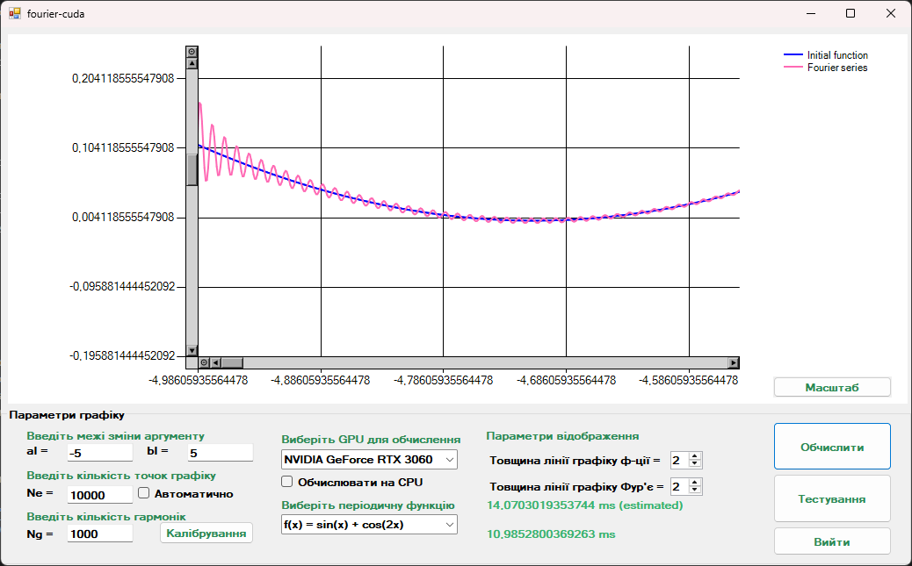

# fourier-cuda

This repository contains a C++/CLI application implementing the **Discrete Fourier Transform (DFT)** algorithm. The project serves as a benchmark tool to demonstrate the efficiency of parallel computing by comparing a custom **CUDA-based implementation** against a standard sequential CPU approach.



## Overview

The core objective of this project is to implement the mathematical model of Harmonic Decomposition and Signal Reconstruction using two distinct architectural approaches:

1.  **CPU Backend:** A classic sequential implementation of the DFT algorithm with $O(N^2)$ computational complexity.
2.  **GPU Backend:** A parallel implementation where the summation logic is executed on NVIDIA GPU cores using custom **CUDA kernels**.

> **Note:** This project implements the direct DFT summation logic manually to demonstrate the SIMT architecture principles, rather than relying on optimized libraries like cuFFT.

## Architecture

The solution is modular and consists of three main components:

* **`fourier-cpu-lib.dll`**: Native C++ library for sequential execution.
* **`fourier-lib.dll`**: CUDA C++ library containing GPU kernels and memory management logic.
* **`fourier-ui.exe`**: A Windows Forms (C++/CLI) GUI client that consumes both libraries to visualize results and measure execution time.

*Developers can use the compiled DLLs to integrate the computational logic into their own custom clients.*

## Workflow

The application does not process real-time signals. Instead, it operates on generated datasets based on user-defined parameters:

1.  **Configuration:** The user defines the function range $[a, b]$, the number of discretization points ($N_e$), and the number of harmonics ($N_g$).
2.  **Calculation:** The system computes the Fourier coefficients ($a_k, b_k$) and reconstructs the function $Y(t)$.
3.  **Benchmarking:** The application measures the precise execution time (in milliseconds) for both CPU and GPU to calculate the Speedup factor.
4.  **Visualization:** Results are plotted on a static graph for verification.

## Installation (Binaries)

Pre-built binaries for Windows are available for testing:

1.  Navigate to the [**Releases**](../../releases) section.
2.  Download the latest archive.
3.  Extract the contents.
4.  Run `fourier-ui.exe`.

## Build from Source

### Prerequisites
* **IDE:** Microsoft Visual Studio (any version that supports CUDA toolkit).
* **Workloads:** Desktop development with C++; C++/CLI support.
* **SDK:** NVIDIA CUDA Toolkit (v11.8+).
* **Hardware:** NVIDIA GPU with Compute Capability 3.5+.

### Build Steps
1.  Clone the repository:
    ```bash
    git clone [https://github.com/the-darkkk/fourier-cuda](https://github.com/the-darkkk/fourier-cuda)
    ```
2.  Open `fourier-cuda.sln` in Visual Studio.
3.  Ensure the configuration is **Release** / **x64**.
4.  Build the solution (hit **Ctrl+Shift+B**).

## License

This project is distributed under the **GPL-3.0 License**. See the [LICENSE](LICENSE) file for more information.